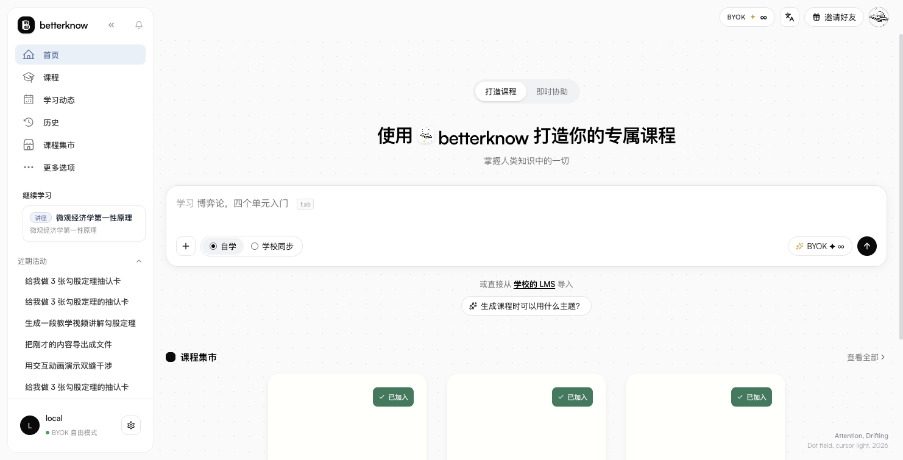
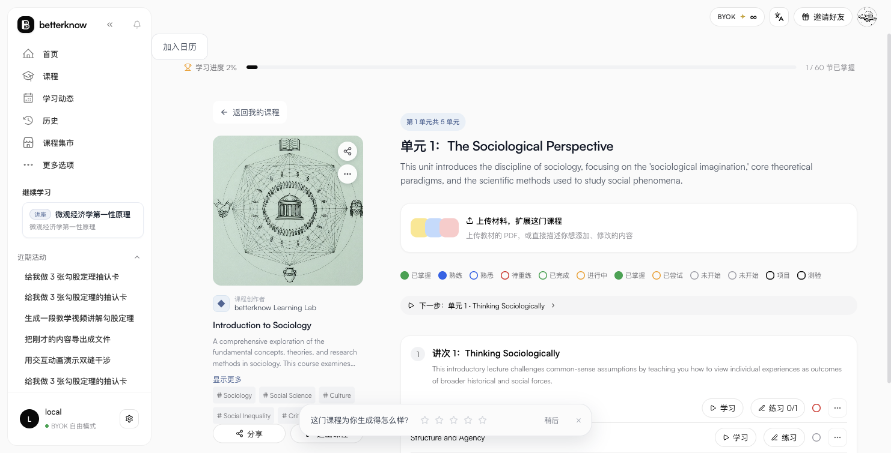
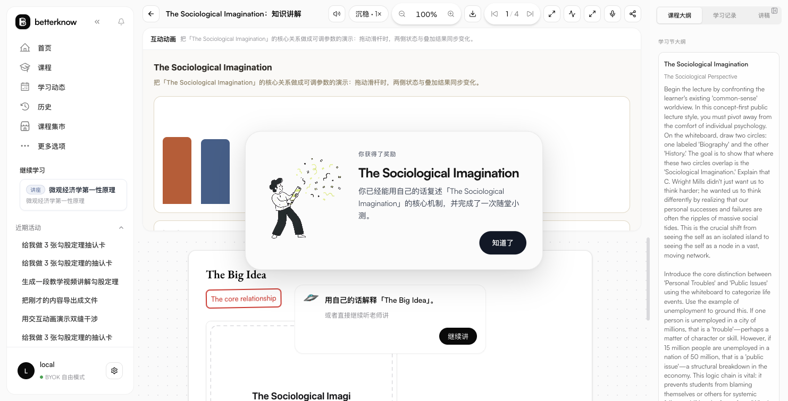
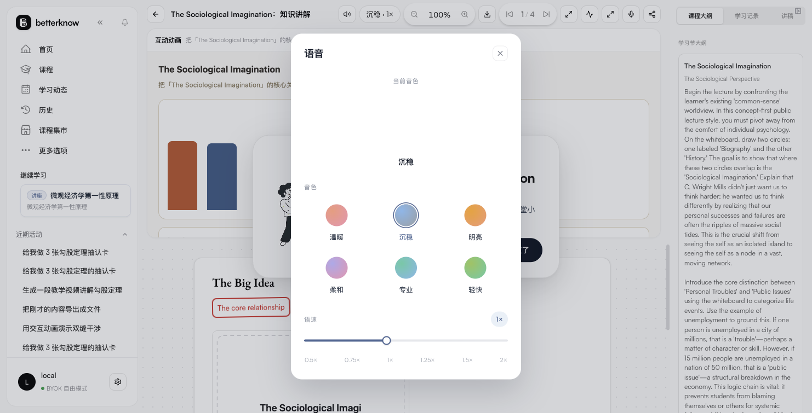
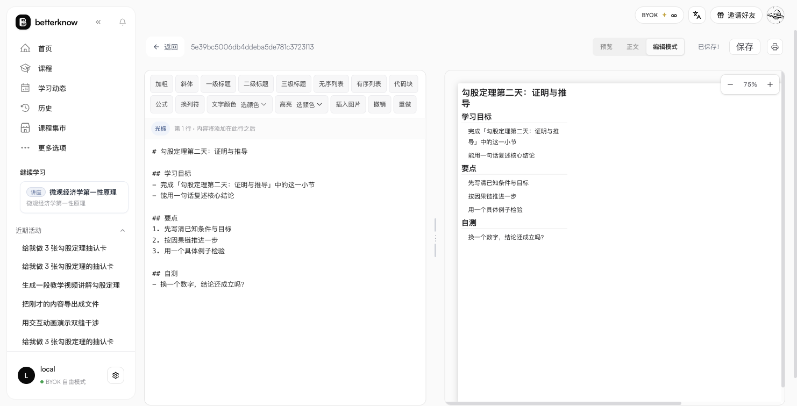
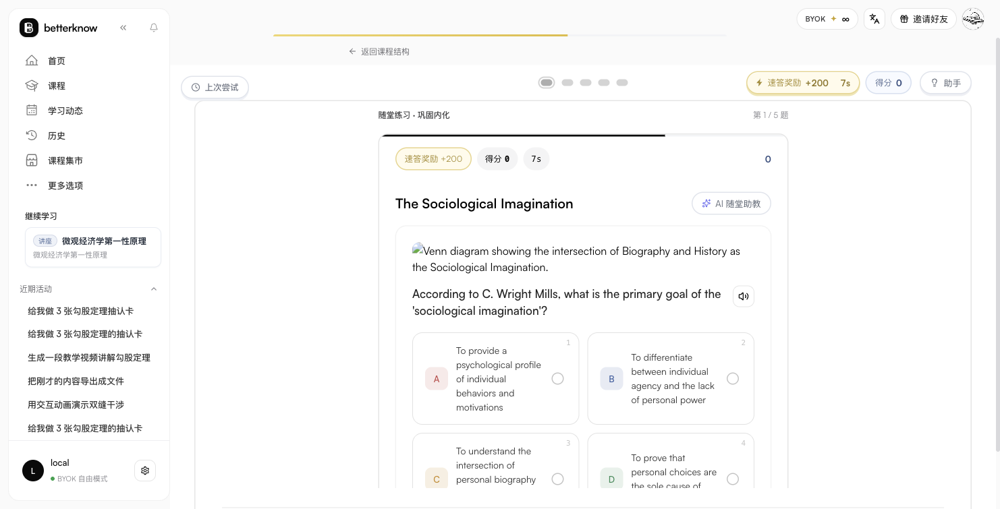
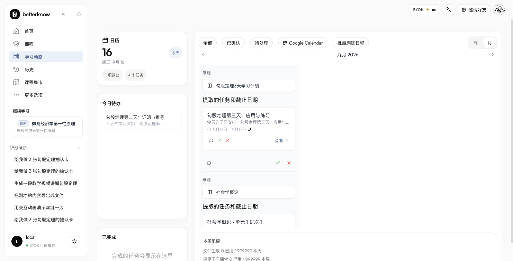
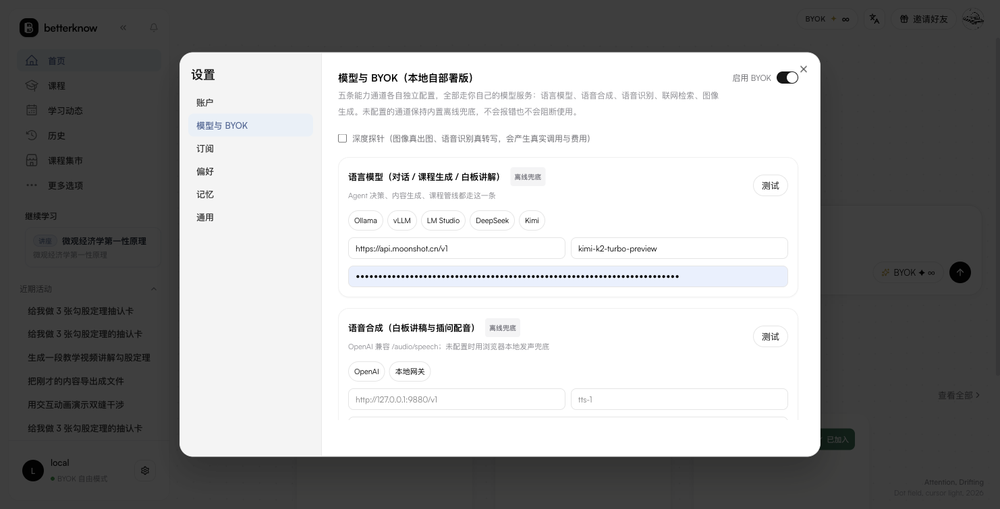

# betterknow

> **所有能力自由驱动，随心接入任意大模型 · 面向下一代交互教学的 AI 教育平台**

**betterknow** 是一套现代化、深度交互的智能 AI 教育平台。平台以**第一性原理**和**苏格拉底教学法**为核心，打破传统一问一答式的碎片问答壁垒，通过**课程大纲规划**、**动态分步推演白板**、**自适应即时测验**与**考前高密度速查表**，为学习者构建结构化、体系化的认知跃迁闭环。

本项目已全面废除积分消耗与商业壁垒，采用 **BYOK（Bring Your Own Key）自由驱动架构**，支持接入 Kimi、OpenAI、DeepSeek、OneAPI 或本地私有大模型（Ollama / vLLM）。

---

## 🌟 核心特性

### 1. 🎓 专属课程体系打造 (Craft Courses)
- 输入任意主题、研学目标或专业学科，AI 自动进行网络调研、知识点拓扑排序，生成完整的单元（Unit）、讲次（Lecture）与细分课节（Session）。
- 每节课配套自动化生成的**随堂练习（Practice）**、**单元综合考试（Exam）**与**三阶段综合实战项目（Project）**。
- 支持课程材料增补上传（Upload Material），覆盖“整门课程”、“指定单元”与“指定讲次”多级范围定制。

### 2. 💡 苏格拉底认知梯子与即时协助 (Instant Assistance)
- 内置 **5 阶苏格拉底认知梯子**（直觉钩子 → 形式化公理定义 → 经典反直觉案例 → 认知反思 → 主动回忆自测）。
- 杜绝死记硬背，引导学习者在严密数学逻辑与物理直觉中发现底层规律。
- 自动生成单选、多选与填空测验题，支持即时打分、解析与盲区追问。

### 3. 🎨 动态白板推导课堂 (Interactive Whiteboard)
- 实时 WebSocket 流式推送分步板书推导。
- 深度支持 **LaTeX / KaTeX** 严密数学公式渲染、代码高亮沙箱与图形化思维导图。
- 老师与学生双向语音互动，支持暂停提问、标注高亮与推演回放。

### 4. 📄 深度学习工作台 (Deep Learn Session)
- 采用双栏工作台架构：左侧结构化任务大纲（Outline）分步追踪学习节点，右侧互动问答沉浸推演。
- 适合系统研读长篇科研论文、啃读复杂数学物理专著与工程架构方案。

### 5. 📑 考前高密度速查表 (Cheatsheet Generation)
- 一键将复杂知识模块浓缩为 2 页极高信息密度的 Markdown / PDF 速查表。
- 涵盖核心概念定义、常用计算公式、认知易错陷阱与速记心智模型。

### 6. 🔑 BYOK 终身自由驱动体系
- **零平台门槛**：所有教学技能、白板推演、课程生成全部免费开放。
- **自由模型接入**：支持 Moonshot / Kimi 长上下文大模型，或自定义 Base URL / API Key 接入兼容网关（OpenAI、DeepSeek、Qwen、Claude 等）。
- **本地私有化适配**：填入本地 Ollama 或 vLLM 地址，学习数据与私有课件 100% 留在本地。

---

想要一份「本仓与线上有什么不同」的对照，看 **[hyperclone/docs/DIFFERENCES.md](hyperclone/docs/DIFFERENCES.md)**（面向使用者，含 BYOK 五通道与已知取舍）。

## 🖼️ 界面预览

下面都是本仓跑起来之后直接截的实机图（stub 模式，未接外部模型；截图存放于 `hyperclone/docs/screenshots/`）。

| 首页 | 课程页（单元 / 讲次 / 练习 / 考试 / 项目） |
|---|---|
|  |  |

| 白板课堂（板书推演 + 大纲 / 学习记录 / 讲稿） | 语音设置（音色 + 语速 + BYOK 试听） |
|---|---|
|  |  |

| 速查表编辑器（预览 / 正文 / 编辑模式 + 自动保存） | 练习与考试（HUD 分数 + 30 分钟倒计时） |
|---|---|
|  |  |

| 学习动态（日历 + 今日待办 + 待处理分列） | 模型与 BYOK（五槽配置与探针） |
|---|---|
|  |  |

更多截图（课程生成问卷、加入日历、网络自检、深度课堂、历史、知识库、考试）见 [hyperclone/README.md](hyperclone/README.md#界面截图本仓实机)。

---

## 🏗️ 架构设计

```
betterknow/
├── app/                       # 前端客户端 (React 19 + TypeScript + Vite + Tailwind CSS)
│   ├── src/
│   │   ├── components/        # 弹窗、模态框、布局与基础 UI 控件
│   │   ├── pages/             # 首页、课程集市、白板课堂、深学工作台、导览等 44 个路由
│   │   ├── lib/               # API 通信层、状态管理与用户上下文
│   │   └── hooks/             # 交互动效与响应式适配 Hook
│   └── public/                # 动态视觉资产、插画与字体库
│
├── hyperclone/                # 核心服务端引擎
│   ├── server/
│   │   ├── src/
│   │   │   ├── agent/         # Director Agent 认知调度管线与 Socratic Ladder 实现
│   │   │   ├── rest.ts        # RESTful API 端点 (课程、练习、考试、日历、用户)
│   │   │   ├── ws.ts          # WebSocket 通信协议 (即时协助、白板、课程实时生成)
│   │   │   ├── store.ts       # 本地 JSON 状态持久化引擎
│   │   │   ├── providers/     # BYOK 大模型驱动网关
│   │   │   └── seedCourses.ts # 种子课程解析器与动态合成调度
│   │   ├── prompts/           # Socratic 系统提示词与 6 大核心教学技能 Prompt
│   │   └── seed/              # 34 门涵盖自然科学、计算机、人文社科的完整题库与课程数据
│   └── spec/                  # 接口协议与状态流转规格说明
│
└── agent-runtime/             # 独立 Agent 守护进程与工具链集成
```

---

## 🚀 快速开始

### 环境依赖
- **Node.js**: >= 20.0.0
- **npm** 或 **pnpm**

仓库里是两个包：`app/`（前端）与 `hyperclone/server/`（后端，同时托管 `app/dist`）。

---

### 推荐：单端口跑全栈（生产模式）

```bash
# 1) 安装依赖
npm install --prefix app
npm install --prefix hyperclone/server

# 2) 构建前端与后端
npm run build --prefix app
npm run build --prefix hyperclone/server

# 3) 启动（默认 http://127.0.0.1:8787，页面、REST、WebSocket 都在这个端口）
PORT=8787 npm run start --prefix hyperclone/server
```

> 服务端首次启动会在 `var/data/state.json` 初始化默认开放用户与演示数据，开箱即用；`var/data/` 可以整个删掉重新开始。

---

### 备选：只改前端时用 Vite 开发服务器

```bash
npm run dev --prefix app        # Vite :5173，已把 /api、/ws 代理到 127.0.0.1:8787
```

后端没有 watch 脚本：改完 `hyperclone/server/src` 需要 `npm run build --prefix hyperclone/server` 再重启。

---

## ⚙️ 模型配置（本地 BYOK 版）

五条能力通道各自独立配置，全部指向你自己的模型服务；未配置的通道保持离线兜底，功能不中断：

| 通道 | 用途 | 接口约定 | 本地预设 |
| :--- | :--- | :--- | :--- |
| **语言模型** | 对话、课程生成、白板讲解、测验出题 | OpenAI 兼容 `/chat/completions` | Ollama `:11434/v1`、vLLM `:8000/v1`、LM Studio `:1234/v1` |
| **语音合成** | 白板讲稿与插问配音 | `/audio/speech` | OpenAI、本地 GPT-SoVITS 网关 |
| **语音识别** | 语音提问转写 | `/audio/transcriptions` | OpenAI whisper、faster-whisper 服务 |
| **联网检索** | 课程调研、「今日值得学」 | `POST /search {query,max_results}` | Tavily、自建 SearXNG |
| **图像生成** | 白板插图、课程封面 | `/images/generations` | OpenAI、本地 SD 网关 |

配置入口：首页右上的 **BYOK** 徽章或侧栏「模型与 BYOK」。
每条通道有 **测试** 按钮：默认走 `models`/`chat`/`speech` 等轻探针；勾选「深度探针」会真实出图与转写（会产生费用）。
配置只写本机（`hyperclone/server/var/data/state.json`），下一次请求即时生效，无需重启。

运行方式：

```bash
cd hyperclone/server && npm ci && npm run build && PORT=8787 npm start   # http://127.0.0.1:8787
# 也可用环境变量给进程级默认值（面板配置优先于环境变量）
# BYOK_LLM_*（或 KIMI_/OPENAI_/AIGW_）、BYOK_TTS_*、BYOK_STT_*、BYOK_SEARCH_*、BYOK_IMAGE_*
```

### 生成任务与语音

- **课程生成是服务端任务**：`start_course_generation` 之后管线在服务端跑，页面只是订阅者；离开页面不会中断，回来 `resume_course_generation` 会把断线期间的帧按序回放（含检索进度、问卷、结构确认、完成帧）。任务日志落 `var/data/generation_runs/<run_id>.json`，`GET /api/v1/course-generation/generation-log/{run_id}` 可查。
- **语音（TTS）**：所有朗读走同一条服务层——内容寻址缓存（同文本同 URL，命中不再打模型）、`pcm` 直出（供白板 `interject_pcm` 实时播放，网关不支持时回落 mp3 + 占位 PCM）、语音表 `GET /api/v1/tts/voices`（provider 有 `/audio/voices` 就用它，否则内置 `warm|calm|bright|gentle|firm|lively`）。
- 练习/考试页的朗读按钮优先用你配置的 TTS 模型（`POST /api/v1/tts/synthesize`，voice/speed 透传）；没配 key 时自动回落浏览器语音合成。
- `GET /api/v1/tts/stats` 看缓存命中/占用；密钥仍走 BYOK 面板或 `BYOK_TTS_API_KEY / _BASE_URL / _MODEL`。

### 运行与数据

- **数据目录**：`hyperclone/server/var/data/`（`HYPERCLONE_DATA_DIR` 可改）。`state.json` 的读-改-写带跨进程文件锁（`state.lock`，进程崩溃留下的过期锁会被自动接管），所以同一份数据可以被多个进程安全打开；但媒体与 run 日志仍是本地文件，多副本部署请各自挂同一块盘并避免并发重建。
- **端口占用**：启动时若端口已被占用会直接退出并打印 `lsof -nP -iTCP:<port> -sTCP:LISTEN` 排查命令——故意不静默带病运行，否则你会对着旧进程调代码。
- **生成日志**：每次课程生成落一个 `var/data/generation_runs/<run_id>.json`（事件时间线、错误日志、总耗时），`GET /api/v1/course-generation/generation-log/{run_id}` 直接读它；同一 run 的写入串行且原子替换，不会出现半截文件。

本地 BYOK 版的取舍：**不引入账号体系与鉴权服务**（设备免登 + 本地 JWT）、**不做积分与订阅**、**不接云存储**（媒体落 `var/data/whiteboard/**`）。接口字段仍按上游形状返回，前端无需分支。

---

## 📖 教学技能体系

Director Agent 内置 6 大教育交互技能：

| 技能名称 | 标识符 | 核心功能 |
| :--- | :--- | :--- |
| **概念拆解** | `conceptExplanation` | 苏格拉底认知梯子、第一性原理推导与自适应测验 |
| **体系深学** | `systematicLearning` | 多阶段章节规划、里程碑式学习与掌握度跟踪 |
| **白板教学** | `whiteboardSession` | 分步可视化板书、公式演算推导与图文结合 |
| **速查表生成** | `cheatsheetGeneration` | 核心考点提炼、关键公式图表与 2 页紧凑排版 |
| **文献导读** | `documentReading` | 论文与研报分节导读、背景剖析与方法论提炼 |
| **学习计划** | `planTasks` | 智能日历规划、任务分解与学习进度安排 |

---

## 📄 许可证与免责声明 (License & Disclaimer)

本项目基于 **MIT License** 开源，详情请参阅根目录下的 [LICENSE](./LICENSE) 文件。

### ⚠️ 二次开发与学术研究声明 (Research & Educational Notice)
1. **逆向与二次开发性质**：本项目（betterknow）系基于对现代 AI 探究式交互与苏格拉底教学产品架构的逆向研究与洁净室独立二次开发（Clean-Room Secondary Development）而成的开源成果。
2. **研究与非商业目的**：本项目研发的唯一目的为教育学探索、人机交互协同研究以及大模型教育 Agent 的互操作性验证。项目并不隶属于任何原商业实体，亦未获得任何第三方的商业背书。
3. **商标与版权说明**：文档与界面中涉及的所有第三方商标、商业名称及产品资产，其专属权利均归原权利人所有。在本项目中的技术对照与还原仅用于互操作性验证与学术分析。
4. **合规义务**：使用者在进行二次开发或本地运行部署时，须自行确保遵循所在地区相关开源合规与大模型服务政策。项目作者与贡献者不对任何下游商业使用或连带风险承担法律责任。
