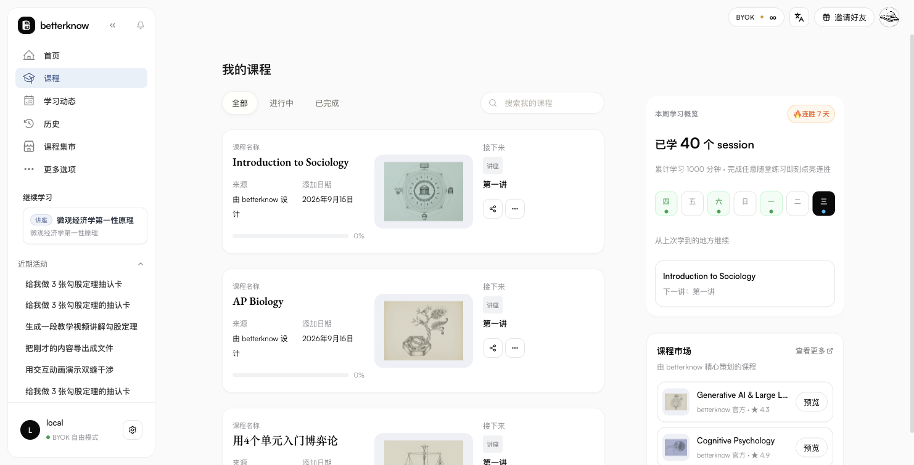
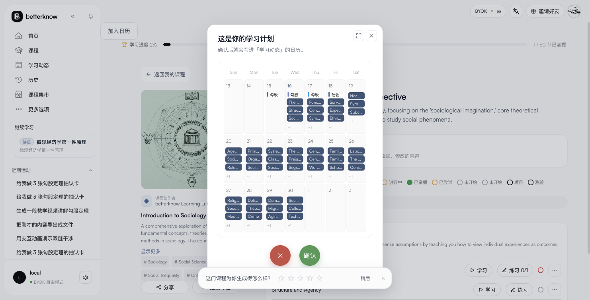
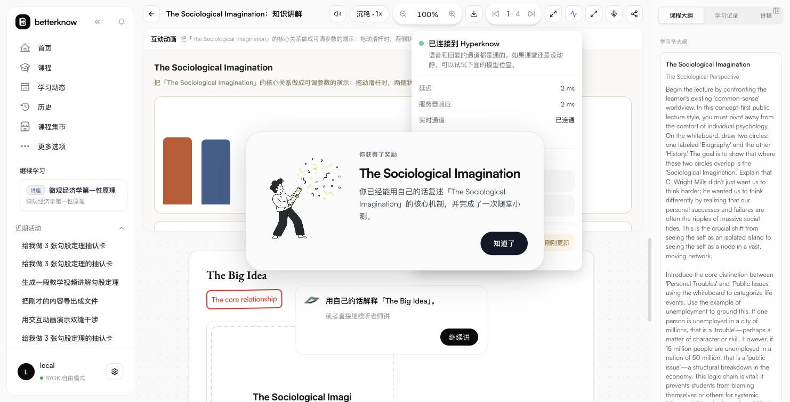
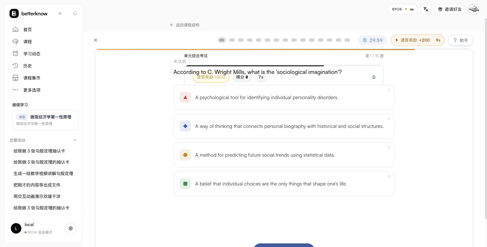
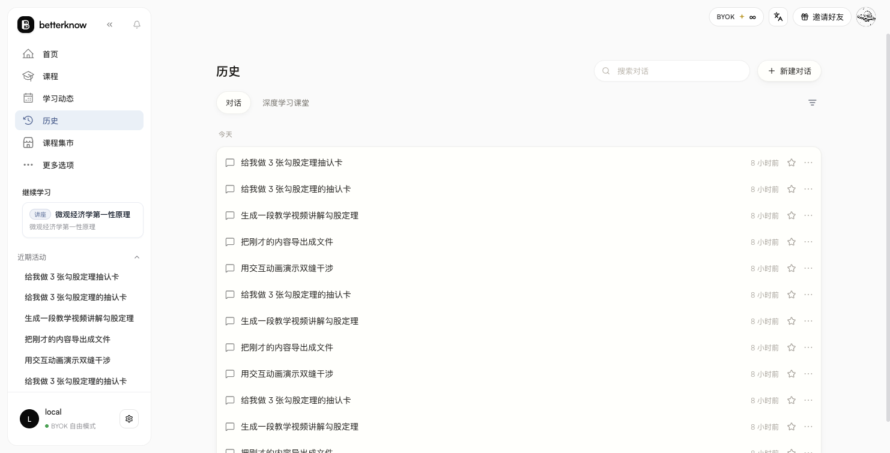
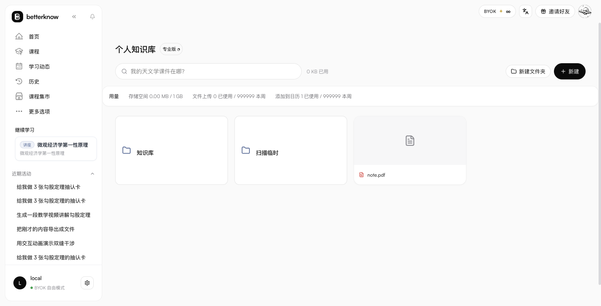
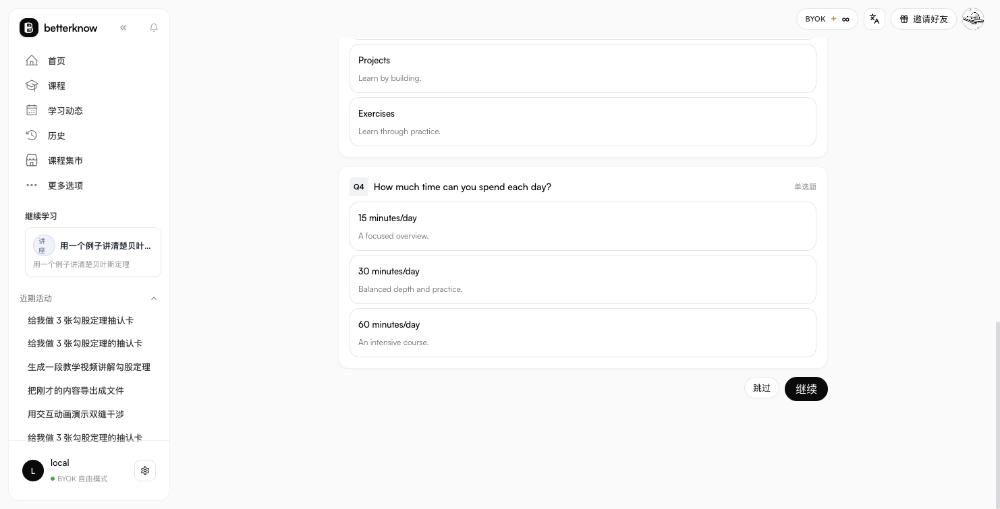
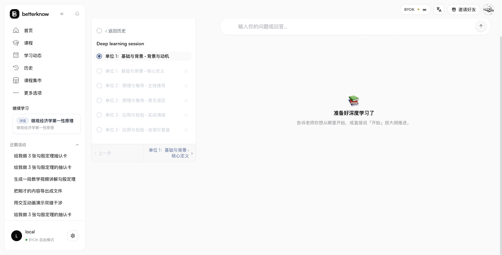

> ## 开放模式（2026-09-03）：无登录墙、无积分闸门
> - 服务端内置单一开放用户 `local-open-user`（tier=pro、credits 恒定 999999）；所有 REST 401 面移除，WS 无 token 也落开放用户；register/login/login_refresh 任意输入即发令牌；`GET|ALL /api/v1/auth/auto_token` 供前端自取。
> - 前端：`public/index.html` `<head>` 首行同步 XHR 自取令牌（无 token 才拉）；assemble-frontend.mjs 会保持该注入幂等。
> - 额度端点统一回报 Pro/999 上限；chat 不再扣费；delete_account 对开放用户禁用。

# Hyperclone

Hyperclone 是 Hyperknow 的本地可运行复刻：React/Vite 前端、Fastify 后端、JSON 文件持久化，以及三条与原站帧形状兼容的 WebSocket 通道。所有模型调用均走 BYOK；没有密钥时自动使用仓库内固定 stub 数据，保证离线闭环。

## 架构总览

```text
web (5173) ── REST /api/v1/* ──┐
             WS                ├─ server (8787) ── var/data/*.json
             /ws                │
             /whiteboard/ws     │
             /course-generation │
```

### 前端页面地图

- `/`：Home，最近活动、快捷入口、Marketplace 推荐
- `/courses`：Your Courses，课程状态筛选与课程卡片
- `/marketplace`：课程发现、分类筛选、搜索与课程预览
- `/learning-feed`：学习日历、今日待办与完成项
- `/history`：历史会话
- `/knowledge-base`：个人知识库
- `/inbox`：消息与更新
- `/onboarding`：语言、来源、学习身份问卷及产品导览
- `/whiteboard/:sessionId`：课程白板教学会话
- `/settings/*`：账户、偏好、记忆、订阅、优惠码、通用设置

### WebSocket 三通道

1. **对话**：`/ws?conversation_id=&token=`，发送 `user_message`，接收 thinking/tool/content/complete 帧。
2. **白板**：`/whiteboard/ws?access_token=`，处理课程会话、板面、讲义大纲、TTS 与暂停/插话。
3. **课程生成**：`/course-generation/ws?access_token=`（以及 `/course-generation/update`），处理研究、课程结构、问卷、确认和完整课程对象。

帧字段与客户端事件以 [`spec/PROTOCOL.md`](spec/PROTOCOL.md) 为准，不在页面代码中另造协议。

### agentLoop

对话服务按 `think → (get_skills/memory/search) → 内容或动作工具 → mark_response_complete → recommend_next_step` 运行。没有有效产出时最多重试约 15 轮，再返回 stub/降级内容；`speed_mode=fast` 会跳过记忆、提问、搜索文件、内容规划等工具并直接生成快速回答。工具注册表与六个技能指纹位于 [`seed/skills_registry.json`](seed/skills_registry.json)。

## BYOK 五槽（llm / tts / stt / search / image）

五条能力通道各自独立配置，**用户配置优先于环境变量**，都没有就退到内置兜底（`stub`）。两种配法等价：

1. **设置面板**（推荐）：右上角设置 → 模型与 BYOK → 每张卡片填 Base URL / 模型 / API Key → 「测试」看探针结果 → 保存。
   - 浅探针：llm/tts/stt/image 打 `/models`、search 打 `/search`，各一次真实请求；深探针另外真出图（`/images/generations`）与真转写（`/audio/transcriptions`）。
   - 面板保存走 `PUT /api/v1/auth/byok {providers:{<seam>:{apiKey,baseUrl,model,enabled}}}`；单槽写法 `{seam, base_url, api_key, model}` 也收，且只动这一槽（早期只认批量写法，单槽会静默改到 llm 顶层，已修）。
   - 配置落在 `var/data/state.json` 的 `<user>.byok.providers`，按用户隔离；API Key 回显只给掩码。
2. **环境变量**（容器/无人值守）：`BYOK_TTS_API_KEY`/`_BASE_URL`/`_MODEL`、`BYOK_STT_*`、`BYOK_SEARCH_*`、`BYOK_IMAGE_*`；LLM 槽用 `KIMI_API_KEY`、`OPENAI_API_KEY`（配 `OPENAI_BASE_URL`）或 `AIGW_API_KEY`+`AIGW_BASE_URL`；`BYOK_PROVIDER=stub` 可强制离线。

各槽吃到的地方：

| 槽 | 端点形状 | 用在哪 |
|---|---|---|
| llm | OpenAI 兼容 `/chat/completions`（流式取 `choices[0].delta.content`） | 主对话、课程生成、白板讲解与答疑、出题、Agent 决策 |
| tts | OpenAI 兼容 `/audio/speech` | 白板 `tts_segment` / `interject_audio`；没配走浏览器语音合成兜底并在帧里标 `stub` |
| stt | OpenAI 兼容 `/audio/transcriptions` | 语音提问/打断三条链：`voice_stream_*`（PCM→WAV）、`user_message{audio_b64}`、`interject_question{audio_b64}` 与 `interject_audio_chunk{pcm_b64}` |
| search | 通用 JSON `POST /search {query,max_results}`（Tavily/Serper 形状） | 课程生成的 `researching_the_web` 阶段 |
| image | OpenAI 兼容 `/images/generations` | 白板插图（512×512）；没配出 SVG 占位并在帧里标 `stub` |

## 安装、开发、构建、启动

要求 Node.js 20+ 与 npm（或 Bun）。仓库里是两个包：`app/`（前端）与 `hyperclone/server/`（后端，托管 `app/dist`）。

安装：

```sh
npm install --prefix app
npm install --prefix hyperclone/server
```

生产构建与启动（一条命令起全栈）：

```sh
npm run build --prefix app
npm run build --prefix hyperclone/server
PORT=8787 npm run start --prefix hyperclone/server
```

然后访问 `http://localhost:8787` —— 页面、REST、WS 都在这个端口上。

只想改前端时可只跑 Vite（`vite.config.ts` 已把 `/api`、`/ws` 代理到 `127.0.0.1:8787`）：

```sh
npm run dev --prefix app        # Vite :5173
```

后端没有 watch 脚本：改完 `hyperclone/server/src` 要 `npm run build --prefix hyperclone/server` 再重启（见下面的坑 2）。

面向使用者的差异说明（哪些与线上一致、哪些不同、为什么）见 **[docs/DIFFERENCES.md](docs/DIFFERENCES.md)**。

## 能力面貌（2026-09 现状）

| 面 | 状态 |
|---|---|
| 课程生成 | 全链路：调研 → 大纲 → 问卷（4 题，含自定义）→ 结构确认 → 讲次/练习/考试/项目；运行记录落 `var/data/generation_runs/<run_id>.json`，回放口 `/course-generation/generation-log/<run_id>` |
| 白板课堂 | 分步板书（`board`/`speak`/`annotation`/`ask`）、LaTeX/KaTeX 公式、插图（`image_gen_pending` → `generated_image`，512×512）、TTS（`tts_segment`，可 `interject_pcm` 流式）、打断答疑（`interject_*` 全套）、侧栏三 tab（课程大纲 / 学习记录 / 讲稿）与收起展开、声音开关与倍速 |
| 语音 | 麦克风提问/打断三条链 + 语音模式卡片（线上文案与 localStorage 键）；客户端 VAD、实时 PCM 分片与「N 秒后发送」倒计时未做 |
| 速查表 | A4 打印版式阅读器 + 三模式（预览/正文/编辑模式）+ 工具栏（加粗/斜体/标题/列表/代码块/公式/换列符/文字颜色/高亮/插图/撤销/重做）+ 3 秒静默自动保存 + 离开拦截；编辑器是 markdown 文本域，不是线上那套 tiptap |
| 练习 / 考试 | 计分口径逐字搬运（`base 600 + 连对 ≤400 + 速答 200`，窗口 10s）、HUD 分数老虎机滚动、考试 30 分钟倒计时（归零交卷）、结果页（百分比/答对数/速分/逐题回顾）；分数落 `progress-status` 的 `examScores`/`practiceStats` |
| 学习动态 | 日历（周/月视图、拖拽改期、与已有任务冲突预览）、左栏三卡（日历摘要 / 今日待办 / 已完成）、「待处理」按来源分列 + 整列确认/拒绝、任务详情（描述/相关截止日期/子任务文件卡三态/评论以调整） |
| 知识库 / Drive | 上传、文件夹、加日历（计入配额）、文件可被引用；上传会连元数据一起落盘（缺 sidecar 会导致 `/api/v1/files/<id>` 404，已修） |
| 课程加入日历 | 三步问卷 → 服务端出稿 `POST /course-calendar/draft` → 预览（可拖拽/全屏）→ `accept` 落库（替换语义） |
| 深度课堂 / 市场 / 历史 / 收件箱 | 页面与主要交互齐备（大纲 + 任务计划、预览与报名、筛选与星标、通知列表） |
| 本地化 | 界面文案取线上中文原文；语言偏好（设置里那项）影响**生成内容语言**与 `ui_language` 参数，界面 chrome 未做多语 |
| 明显缺席（有意） | 第三方埋点（intent pixel / Clarity）、错误上报到原站、Stripe/优惠券/积分、Google·Canvas OAuth、邮件与计费后台 |

## 界面截图（本仓实机）

下列截图都在本仓跑起来之后直接截的（stub 模式，未接外部模型），路径 `hyperclone/docs/screenshots/`。

### 首页与课程

| 首页 | 课程列表 |
|---|---|
|  |  |

| 课程页（单元 / 讲次 / 练习 / 考试 / 项目） | 课程加入日历（三步问卷 + 预览，可拖拽/全屏） |
|---|---|
|  |  |

### 白板课堂

| 板书推演 + 右侧三 tab（课程大纲 / 学习记录 / 讲稿） | 语音设置（音色 + 语速 + 试听） |
|---|---|
|  |  |

| 网络自检（状态 / 指标 / 原因 / 进阶检查） | 速查表编辑器（三模式 + 工具栏 + 自动保存） |
|---|---|
|  |  |

### 练习、考试与学习动态

| 练习（HUD 分数 + 速答奖励） | 考试（30 分钟倒计时 + 逐题） |
|---|---|
|  |  |

| 学习动态「待处理」按来源分列 + 批量确认/拒绝 | 历史会话 |
|---|---|
|  |  |

### 知识库与设置

| 个人知识库（上传 / 加日历） | 模型与 BYOK（五槽 + 探针） |
|---|---|
|  |  |

| 课程生成（4 步进度 + 问卷） | 深度课堂（大纲 + 任务计划） |
|---|---|
|  |  |

> 重新生成这些截图的步骤：`npm run build --prefix app && npm run build --prefix hyperclone/server && PORT=8787 npm run start --prefix hyperclone/server`，然后按「运行须知」里的访问方式逐个页面截。截图脚本不入库（在本地 `reference/` 下）。

## 运行须知（自部署实践）

**启动**：`npm run build --prefix web && npm run build --prefix server && PORT=8787 npm run start --prefix server`，访问 `http://localhost:8787`（server 直接托管 web 的 `dist`）。开发模式是 `npm run dev --prefix server`（:8787）+ `npm run dev --prefix web`（:5173，代理 API/WS）。

**数据**（全部落在 `hyperclone/server/var/data/`，均已在 `.gitignore`，可整目录删掉重新开始）：

| 路径 | 内容 |
|---|---|
| `state.json` | 唯一状态文件：用户、课程、会话、日历任务、run 索引、usage 计数 |
| `files/` | 上传与生成的公开文件（字节 + `<id>.json` 元数据 sidecar） |
| `tts/` `whiteboard/` `covers/` | 内容寻址的音频、白板插图、课程封面 |
| `generation_runs/` | 课程生成运行事件（可回放） |

**换 key / 换网关**：设置面板改即可（立即生效，按用户存）。**重置**：停服后删 `var/data/`（或只删 `state.json`），重启会重建开放用户与演示数据。

**踩过的坑**（都真实发生过）：

1. **端口被旧进程占着**：改了代码行为没变，先看 `lsof -nP -iTCP:8787 -sTCP:LISTEN`——旧 `dist` 进程活着时新进程起不来。
2. **`dist` 比源码旧**：`tsc` 只在 `npm run build` 时跑；改完 server 源码记得重新 build 再起（本轮就遇到过一次「已改代码但行为没变」）。
3. **多进程共享 `var/data`**：两个 server 指向同一目录会互相覆盖 `state.json`（最后写入者赢）。单实例运行，或各自用 `HYPERCLONE_DATA_DIR` 指不同目录。
4. **BYOK 单槽 PUT**：`{seam, api_key}` 这种写法早期会串槽（改到 llm 的 key），现已修；如果沿用旧构建，请用批量写法 `{providers:{stt:{…}}}`。
5. **语音/插图没配 key**：不会报错，会走兜底并在帧里带 `stub: true`——排查「为什么是占位图/合成音」先看这个字段。

**规格与证据在哪**：协议与端点在 `hyperclone/spec/PROTOCOL.md`，样式与文案来源在 `DESIGN_TOKENS.md`，与线上的差异与未做项在 `DESIGN_GAPS.md`，页面契约在 `PAGE_CONTRACTS.md`。抓包证据在 `reference/`（**仅本地保留，不进仓库**）。

## 安全说明

- `seed/prompts/directorAgent_system_prompt.md` 是从证据资产本地化的提示词，不在运行时从原站拉取；`seed/skills_registry.json` 只保存可观测的技能触发/问题轴，不包含秘密服务端实现。
- 提示词和 seed 数据属于应用资产，部署时应按内部资产处理；不要把 API key、用户文件、JWT 或真实会话写入这些文件。
- BYOK key 仅通过服务端环境变量注入，前端不应读取或持久化；日志中不得打印 Authorization、query token 或完整提示词。
- 本地 mock 的公开文件/分享接口仅用于复刻行为，生产部署前必须加鉴权、访问控制和速率限制。
- 协议事实源、证据和原站资产仅供复刻验证；不得将本地实现误认为 Hyperknow 官方服务。

## Seed 数据
> ## 2026-09-03 收口说明
> - 静态资产：513 项引用 0 缺失（字体 878 文件含 KaTeX/Assistant/Virgil/Xiaolai 分片、onboarding 84 文件、images 全量）。
> - WS 通道 7/7 条（新增 deep_learn/drive/net-check；pdf 导读 speak/annotation/ask/done 全相；语音全双工 interject cascade + interject_pcm；白板扩展帧）。
> - REST：marketplace 33 门课 52.8MB 灌入 seed（enroll 409 幂等、check-fill (sessionId,questionId) 配对判分、exam/score 客户端权威记账、progress/structure/state 全链）。
> - 管线：`src/pipelines.ts` 课程 6 相位 prompt 组 + 视频（ffmpeg 真渲染 mp4，finder 探测降级）+ publish_file 纯 TS PDF + `sandbox.ts` 真执行沙箱 + `cron.ts` credit 12h 重置。
> - BYOK 扩展位：`providers.{tts,stt,search,image}` 空置待钥，见 config.ts。
> - 验证：`scripts/smoke_seed.mjs`、`smoke_ws2.mjs`、`smoke_pipelines.mjs`、`smoke_e2e.mjs` 四件全 PASS。

- `seed/marketplace_courses.json`：从第四轮 REST 证据完整提取的 33 门原始课程对象。
- `seed/daily_trends.sample.json`：`dailyTrends` 原文的 US 区域趋势样本。
- `seed/onboarding_questions.json`：从 onboarding 截图文字提取的语言、来源和学习身份问卷，统一为 `{step,title,options:[{label,subtext}]}`。
- `seed/prompts/directorAgent_system_prompt.md`：directorAgent 提示词原样副本。
- `seed/skills_registry.json`：六个可观测 skill 的触发条件、问题轴和后续工具链。

## 前端与静态托管

只有一套前端：`app/`（React + Vite）。`hyperclone/server` 用 `@fastify/static` 托管 `app/dist`（`STATIC_ROOT` 可覆盖），所以生产模式只需 build 一次 `app`，`:8787` 同时给页面与 API/WS。

历史说明：早期仓库里并置过一份「原站生产 chunk 镜像」前端（`server/public/`）与一枚独立的 `/byok/` 配置页，二者都已移除——现在配置 BYOK 一律走应用内的设置面板（见上），镜像前端也不再随仓库提供。早期的 parity 截图（`hyperclone/verify_*.png`）是那个阶段的历史产物。

已知取舍：

- Google / Canvas OAuth 外联不复制（原站 Supabase 域名不会被调用，本地也不会向其发请求）。
- 视频合成管线（Remotion + Manim）以帧协议与端点形状 mock 返回，真实 ffmpeg 合成器未实现。

## 网关接入速查

- **面板**：设置 → 模型与 BYOK，五槽各填 Base URL / 模型 / Key，点「测试」看探针，保存即生效。
- **只要一个 env 就能跑**：`AIGW_BASE_URL=<OpenAI 兼容网关> AIGW_API_KEY=<key> PORT=8787 npm run start --prefix server`（LLM 槽走它；其余槽没配就走兜底）。
- **完全离线**：`BYOK_PROVIDER=stub`，或什么都不配——所有槽退到内置 stub，帧里带 `stub: true`。
- **混搭**：LLM 用云、TTS/STT 用本地（如 Ollama 只给 LLM、本地 whisper 给 STT、本地 ComfyUI 给 image）都行，槽之间互不影响。

## 脱钩说明

运行时不再向任何 hyperknow 域（`agent.hyperknow.io`、`api.hyperknow.io`、`dev-api*`、`service*`、`mcpbxxrodqgsmatssajx.supabase.co`）发请求：认证是本地签发的 JWT（设备免登 `POST /api/v1/auth/auto_token`），模型调用只走你自己配的 BYOK 网关，媒体文件落本地磁盘。第三方埋点与错误上报（intent pixel / Clarity / `error/add_error_log`）有意不做。

早期为做对照保留的「原站生产 chunk 镜像前端」与其组装脚本（`scripts/assemble-frontend.mjs`）已从仓库移除；`hyperclone/recovered/`（反编译留档）与 `reference/`（抓包证据）都是**本地资料，不进仓库**。

